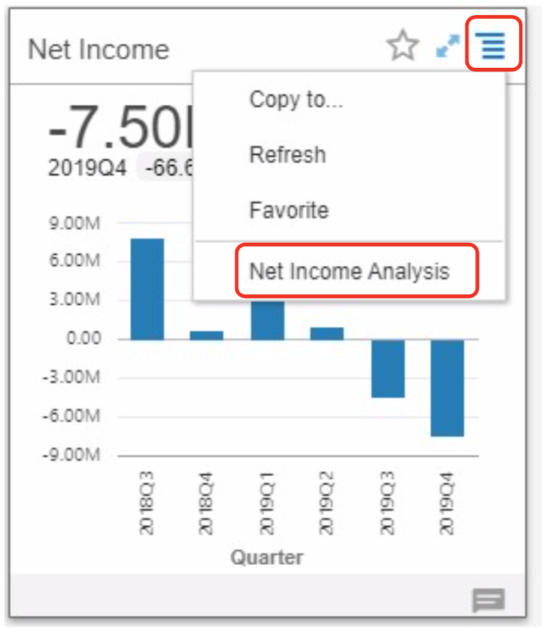

# Lab 700: Oracle Fusion ERP Analytics

<!-- Comment out table of contents
## Table of Contents
[Introduction](#introduction)
-->

## Introduction

In this *Optional Bonus* lab, you will learn about how a finance team can adress analytics questions through Oracle Fusion ERP Analytics.

Finance teams are under enormous pressure to generate more insights, faster, from their financial systems and other critical data sources. But for most organizations, far too much time is spent manually sourcing, managing, preparing, and securing data – leaving far too little time for true analysis and insight.

Oracle Fusion ERP Analytics provides the fastest path to insight with your ERP data, based on its pre-built integration to your ERP Cloud, pre-built data model, and pre-built interfaces – including KPIs, dashboards, and self- service project areas that you can use to easily customize and extend your analysis. And, it’s all built on the foundation of Oracle Analytics Cloud and the self-tuning, self-scaling, self-securing Oracle Autonomous Data Warehouse.

This workshop is designed to give you a hands-on experience with both the pre-built elements of Oracle Fusion ERP Analytics – with a focus on KPIs and dashboards – as well as the intuitive self-service capabilities delivered by the underlying Oracle Analytics Cloud platform.

**_To log issues_**, click here to go to the [github oracle](https://github.com/oracle/learning-library/issues/new) repository issue submission form.

### Objectives

-   Learn how to use the Oracle Fusion ERP Analytics interface through KPI Cards, Decks, Alerts, and Analysis
-   Learn how to perform a Custom Analysis on a Pre-Built Profitability Subject Area
-   Learn how to explore a Balance Sheet Subject Area and create a Trial Balance
-   Learn how to explore an Account Payables Project and create new reports 

### Required Artifacts

-   The following lab requires an Oracle Public Cloud account. You may use your own cloud account, a cloud account that you obtained through a trial, or a training account whose details were given to you by an Oracle instructor.
-   *To access the workshop environment*, you will need internet access and a modern web browser. Your instructor will provide you with a URL for the Oracle Fusion ERP Analytics instance and you will be assigned a username and password. Please refer to your instructor's confluence page for details. 
-   The estimated time to complete this lab is 40 minutes.

### Extra Resources
-   To learn more about Oracle Fusion ERP Analytics, feel free to explore the capabilities by clicking on this link: [Oracle Fusion ERP Analytics Getting Started Documentation](https://docs.oracle.com/en/cloud/saas/analytics/fawag/get-started-oracle-analytics-applications.html#GUID-66FF30CB-C4C4-4184-9223-DE5AE3E83C80)

## Part 1. Explore the Interface and Pre-Built Content: KPI Cards, Decks, Alerts, and Analysis

### **Step 1:** 

-   Enter the credentials you were given and click the **Sign In** button.

### **Step 2:** 

-   We start at the homepage, where contains KPIs and Decks that you have marked as favorites. Since this is the first time you have logged in, the screen will be blank. Let’s explore how to navigate within the application.

-   Click on the upper left **hamburger menu** icon to see the following:
    1. **Decks** are how KPIs are presented and organized. 
    2. **KPIs** is where you can createand edit the Key Performance Indicators library.
    3. **Projects** is where you can create and edit analysis and reports.
    4. **Data** is where you manage data access and workflows. 

-   Click on **Decks**.

### **Step 3:** 

-   Now, take a moment to review a few of the pre-built decks. From left to right, click on the following:
    1. **Profit and Loss**
    2. **Payables**
    3. **Balance Sheet**
    4. **Financial Ratios**

-   Take a moment to look at the pre- built KPIs on each deck.

### **Step 4:** 

-   From the **Financial Ratios** deck, click the **filter icon** on the top right.

-   **Note** that the current deck is filtered by Current Quarter by default. You can easily change the filter here to focus on a different context, such as business unit, cost center, time, etc.

-   Click the **filter icon** again to make it disappear.

### **Step 5:** 

-   Click on **My P&L** – a custom deck that we have created and shared with you. Every user can easily create their own custom decks with the top KPIs they want to monitor.

-   **Note** that a deck contains one or more KPI “cards.”

-   Each KPI card can be customized in numerous ways. In addition to the visualization, observe that the Revenue KPI Card contains the following:
    1. An **Alert** (the top line is green – as Revenue is above target)
    2. A Comparison to **Target**
    3. A Comparison to **Previous Time Period**

### **Step 6:** 

-   On this deck, we notice that although Revenue is above target, Operating Expenses are trending up.
-   From each KPI, it’s very easy to drill into deeper insights about your finance data. Let’s drill in to OPEX to explore further.

-   Click on the **OPEX KPI card hamburger menu icon**.

-   Select **Operating Expense Analysis**.

### **Step 7:** 

-   This pre-built analysis provides additional visualizations to highlight and accelerate further analysis.

-   Observe the following:
    1. Trailing 12 months and quarterly operating expenses are increasing.
    2. The tree map visualization shows that the Call Center is the top area for expense.
    3. In the bottom bar chart, we see a spike in payroll cost.

-   Finally, click on the **back arrow** at the upper left of the screen to return to the deck.

### **Step 8:** 

-   We’re now back on the My P&L deck, which was shared with you with “view only” access. We want to dig deeper into payroll cost, so we’ll create a new custom deck that we can customize to meet our needs:

-   Click the **hamburger menu icon** on the top right.

-   Select **Add Deck**.

### **Step 9:** 

-   Name your deck **Payroll Deck <insert-initials-here>** 

-   Click the **Save** button.

### **Step 10:** 

-   First, let’s add the **Payroll Cost KPI** to this new deck.

-   Click the **+ icon**.

### **Step 11:** 

-   **Scroll** through the KPI library so you can see all of the out of the box KPIs.

-   Select **Payroll Cost PL KPI**

-   **Note**: You see two Payroll Cost KPIs with very similar names, because one of them is a custom KPI. Be sure to select **Payroll Cost PL**.

-   You will see a Preview of the card, but we want to customize it before we add it to the deck.

-   Click the **Customize Card** button.

### **Step 12:** 

-   Note that by default, this KPI is configured as follows:
    1. Target: compares against the payroll cost budget.
    2. Target Value: set to % Variance from Target.

-   Now we’ll customize the KPI. Click **Show Change** checkbox.

-   By default, Last Period is set to display a Qtr over Qtr comparison.

-   Click the **Last Period** value. 

-   Select **Same Period Last year**.

-   The Preview updates, and we now see a new +% YoY.

### **Step 13:** 

-   We can also customize the visualization itself in this KPI Card.
-   We’ll now do so by adding budget to the visualization.

-   In the **Detail Visualization** section, click **More Options** to expand it.

 
-   **Scroll down** and under **Additional Data**, look for **Values**.

-   In the Values drop-down, select **Payroll Cost Budget**. We now see the budget in the visualization.

-   To make the visualization easier to read,  go to the **VIsualization** box and select **Line Bar Combo**.

### **Step 14:** 

-   Observe how we now see actuals (blue bar) trending over budget (green line).

### **Step 15:** 

-   Now, click the **Conditions** link. The colored line (in this case, red) at the top of the KPI Card is an alert. The default rule is that Payroll Cost >110% is set to red (“Critical”).

-   Let’s customize the alert condition. Change the 110% value to 130% by typing in **130**%.

-   Click the **Add Card** button.

### **Step 16:** 

-   The KPI is now added to the deck. Payroll Cost is trending up plus over budgets. And the alert bar is showing up as yellow (“Warning”).

-   Click the **star icon** to mark as a favorite to put it on our home page.

-   Click the **maximize icon** so we can navigate to a larger card to see more information.

### **Step 17:** 

-   KPI Cards are designed to enable fast, immediate collaboration.

-   Click **Enter message** to create a note to the finance analyst to investigate payroll cost.

-  Type the following: **Lizzy – please investigate why Payroll Cost is trending up and over budget.**

-   Click **Add Note**.

-   Notice that at the bottom of the popup window that the system recommends related metrics. In this case, the system recommends Payroll Cost Budget, Sales and Marketing, and Other Operating Expenses.

### **Step 18:** 

-   Let's continue with our collaboration example. 

-   Click the **camera icon** to attach a snapshot image of the KPI card to the note you sent to Lizzy

-   Click the **back arrow** next to the Notes title.

### **Step 19:** 

-   Now let’s fast forward. Our business analyst, Lizzy, has completed additional analysis on this issue. She can easily share it back with us by attaching it right to the KPI. Let’s take a look at her analysis.

-   Click on the **HR Payroll and Attrition Analysis link**.

### **Step 20:** 

-   Our financial analyst created a detailed analysis based on both financial as well as HR workforce attrition data.
-   Review the analyst’s note: Lizzy observes that overtime pay started to increase in July, which was the same time the Call Center had a spike in attrition. You can see the spike in the lower left visualization.

-   Two additional items stand out:
    1. Statistical trending and forecasting capabilities enhance several visualizations, including the projected attrition trend as well as the future impact of overtime.
    2. Observe the Turnover narrative on the right was created using point and click natural language generation capabilities applied to the “Turnover by Department” visualization.

### **Step 21:** 

-   Let's return to the home page. 

-   Click the **Back arrow** in the upper left.

-   Click **My P&L** deck.

### **Step 22:**

-   Please delete any decks/cards you have made during this workshop by clicking on the cards' **menu bar** and selecting **Remove from Deck** for the cards, and **Delete** for the Deck

-   To recap, in this part, you:
    1. Monitored business performance with pre-built KPIs and pre-built Decks
    2. Drilled into deeper analysis, which is available through pre-built reports
    3. Collaborated with the team – within the platform – to answer questions
    4. Observed how an analyst can easily bring additional data sets – like HR data – into the platform to perform cross- functional analysis.

## Part 2. Custom Analysis on Pre-Built Profitability Subject Area

-    Oracle Fusion ERP Analytics is designed to provide finance teams with the best of both worlds – fast, accurate, access to the latest data from your system of record, along with easy self-service analysis and customization.
-   Let's do some more exploration. Here we will introduce you to the out of the box GL profitability analysis and subject area and show you how to customize and extend to create new analysis and reports.

### **Step 1:** 

-   Starting from the **My P&L** deck, we’re going to drill into the out of the box Net Income Analysis.

-   Click the **Net Income PL** card **hamburger menu icon**.

-   Select **Income Analysis**.

### **Step 2:** 

-   Observe the following: 
    1. Net Income for the current quarter in a waterfall viz
    2. A quarterly trend for net Income, Revenue and Net Income Margin %
    3. Net income details.

-   Click the **Edit button** so we can customize this analysis. 
-   **Note**: this may take some time. If the linked page does not load in a minute, please try using a different browser.

### **Step 3:** 
-   First, begin by clicking on the **small down arrow icon** of the canvas and then **Duplicate Canvas**

-   Rename the canvas by clicking on the **small down arrow icon** of the canvas and then **Rename**
-   Input as the name the following, making sure to input your initials **Overview <insert-initials-here>**

-   Let’s take a moment to tour the self-service project.
-   On the canvas are our four familiar visualizations. Click to highlight one.

-   Observe the grammar pane on the immediate left – it is the control panel for each visualization, allowing you to modify the visualization as needed.
-   Observe the data pane on the far left. Oracle Analytics for Fusion ERP contains a pre-built data pipeline that directly imports your ERP Cloud data, as well as a pre-built data model.
-    From this data pane, you can see views of your finance data organized into constructs called subject areas. Here, we see the Financial – GL Profitability subject area. It is organized into folders containing attributes and metrics.
-    Observe at the bottom left, you see the setting pane for whatever object we select.

### **Step 4:** 

-   Now we’ll build a few visualizations with the pre-built data in this subject area.

-   Click the **+ icon** at the bottom of the screen to create a new canvas.

-   Rename the canvas by clicking on the **small down arrow icon** of the canvas and then **Rename**
-   Input as the name **Fiscal <insert-initials-here>**

-   To build our first visualization, let's make a simple pivot table. In the **Data pane**, do the following:
    1. Click to open the **Time** folder
    2. Right Click **Fiscal Quarter**
    3. Select **Pick Visualization** from the popup window
    4. Select the **Pivot icon**

-   **Drag** the **Data pane** wider so you can see better.

-   Click the **Balancing Segment Hierarchy** folder to open.

-   Double Click **Balancing Segment Level 30 Description**.

-   Scroll down the **data pane**.

-   Click **Facts – Ledger Currency folder** to open.

-   Click **Profit and Loss (LC)** subfolder to open.

-   Double Click **Net Income**.

-   And it’s as simple as that to create your first visualization – slicing and dicing net income by different dimensions.

### **Step 5:** 

-   We’ll create a second visualization by duplicating this pivot table.

-   On the upper right of the pivot table visualization, click the hamburger menu icon

-   Hover over **Edit**

-   Click on Duplicate Visualization to add a duplicate to the canvas.

### **Step 6:** 

-   Select the right pivot table visualization if not selected already

-   Click the **Visualization Type icon**.

-   Select **Area icon** from the dropdown list.

### **Step 7:** 

-   Your new “Area” visualization will now look like this. You can see that the combination of the table and the visualization helps tell the story more clearly.
-   **Note**: If your new visualization looks different from what is shown, double-check the fields on the grammar pane and adjust it as necessary.

### **Step 8:** 

-   We’ll now further customize this visualization by adding data labels.

-   With **# Net Income selected**, scroll down to the bottom left settings panel.

-   Click on the **#** menu, and make the following modifications:
    1. Data Label: Select **Auto**
    2. Font: Select **Auto** and click the **bold icon**
    3. Number Format: Select **Number**
    4. Decimal: Select **None**
    5. Abbreviate: Select **On**

### **Step 9:** 

-   Now your visualization is much more readable with the data values. Let’s create another visualization.

-   On the upper right of the area visualization, click the **hamburger menu icon**

-   Hover over **Edit**

-   Click on **Duplicate Visualization**

### **Step 10:** 

-   Let's reorganize the visualizations on the canvas.

-   Click on one of the area visualizations and drag it above the pivot table. Watch for the blue bar to show before releasing your mouse.

### **Step 11:** 

-   Select the visualization you just dragged to the top (the visualization will be outlined in blue when it is selected).

-   In the grammar pane on the left, remove **Fiscal Quarter** by clicking the **x**.

### **Step 12:** 

-   Let's change the visualization type.

-   In the grammar pane on the left, click **Area**.

-   Select **Donut** from the dropdown list.

### **Step 13:** 

-   Scroll up the Data pane. 

-   Open the **Time** folder.

-   Click and drag **Fiscal Year** to the **Trellis Columns** area in the grammar pane.

### **Step 14:** 

-   The visualization now compares net income by regional segments across fiscal years.

### **Step 15:** 

-   We’ll next create a text narrative description of the area visualization. First let’s duplicate the area visualization. 

-   On the Upper right of the Area visualization, click the **hamburger menu icon**

-   Hover over **Edit**

-   Click **Duplicate Visualization** to add a duplicate to the canvas.

### **Step 16:** 

-   Select the new duplicate Area visualization if not selected already

-   Click the **Visualization Type** icon.

-   Select **Language Narrative icon** from the dropdown list.

### **Step 17:** 

-  A generated narrative describing the Area visualization will appear on the left.

## Part 3. Explore Balance Sheet Subject Area and Create Trial Balance

### **Step 1:** 

-   At the bottom of your screen, click the **+** icon to create a new canvas.

-   Please rename this new canvas to **Financial <insert-initials-here>** by clicking on the **small down arrow icon** of the canvas and then **Rename**

### **Step 2:** 

-   We are going to build a visualization using the Financial – Balance Sheet subject area.

-   Click the **Financials – GL Profitability** to collapse it.

-   Click **Financials – GL Balance Sheet** to expand it.

### **Step 3:** 

-   In the data pane, click the **Facts – Ledger Currency** folder to open it.

-   Click the **GL Balance (LC)** subfolder to open it.

-   Select the following while holding the ctrl key (cmd key for mac users)
    1. **# Activity Amount**
    2.  **# Opening Amount**
    3. **# Closing Amount**
    4.  **# Debit Amount**
    5. **# Credit Amount**

-   After selecting them all, right click to then do the following:
    1. Select **Pick Visualization**
    2. Select **Pivot**

### **Step 4:** 

-   Your pivot table will appear on the canvas. Let’s continue to build this pivot table.

-   In the Data pane, click **Balancing Segment Hierarchy**folder to open it

-   Double Click **Balancing Segment Level 30 Description**

### **Step 5:** 

-   Click **Natural Account Hierarchy** folder to open it.

-   Drag **Natural Account Level 30 Description** to Rows below **Balancing Segment Level 30 Name** (in the grammar pane).

-   Drag **Natural Account Level 29 Description** to Rows below **Natural Account Level 30 Description** (in the grammar pane).

### **Step 6:** 

-   Your trial balance report should look similarly to the image below.

-   In the upper right hand corner of the screen, click the **Save As** icon.
-   Name the project **Net Income Analysis <last name>** and click the **Save** button.

-   **Note**: If you see a generating thumbnail message, click **Skip** to ignore.

### **Step 7:**

-    Nice work on making these canvases and visualizations! Please go ahead and delete the canvases with your initials at this time by clicking on the canvas **down arrow icon** and selecting **Delete**. There should be three canvases you need to delete, **Overview <insert-initials-here>**, **Fiscal <insert-initials-here>**, and **Financial <insert-initials-here>**

## Part 4. Explore Account Payables Project and Create New Reports

### **Step 1:** 

-   Let’s navigate to the Home page

-   Select the **hamburger menu icon** on the top left.

-   Click **Home**.

### **Step 2:** 

-   Below the Get Started banner, you will see shortcuts to pre-built analyses. 

-   Click **Projects and Reports**

-   Click **Modified** and Select **Name**

### **Step 3:** 

-   Click **AP Analysis Lab**

### **Step 4:** 

-   This project contains analyses across two subject areas, AP Invoices and AP Balances. Visualizations include:
    1. AP Balances quarterly trend.
    2. Top 10 suppliers with AP Balances.
    3. Trailing 12 months for AP invoice transactions.

-   Click the **+ icon** at the bottom of the screen to create a new canvas.

-   Please rename this new canvas to **Analysis <insert-initials-here>** by clicking on the **small down arrow icon** of the canvas and then **Rename**

### **Step 5:** 

-   In the data pane:, click **Financials – AP Balances** to collapse it.

-   Click **Financials – AP Invoices** to expand it.

-   Click **Facts – Ledger Currency** folder to open it.
-   Then, double click **Invoices Amount**

-   Click **Invoice Details** folder to open it.
-   Then, click **Payment Terms** folder to open it.
-   Then, double click **Payment Terms Name**.

### **Step 6:** 

-   Your visualization should look like the following bar chart: Invoice Amount by Payment Terms. 
-   Let’s refine by supplier.

-   Click **Supplier** folder to open it

-   Then, double click **Supplier Name** to automatically add it to your visualization.

### **Step 7:** 

-   In the grammar pane, click **Auto Visualization (Bar)**

-   Select the **Stacked bar icon** from the dropdown list

### **Step 8:** 

-   We’ll now zero in on our top ten suppliers.

-   In the grammar pane, drag **Invoice Amount** from
**Values** to the **Filter**.

### **Step 9:** 

-   Disregard the pop-up window, and instead, at the bottom of the grammar pane, in Filters, click **Invoice Amount**

-   Hover over **Filter Type**

-   Click **Top Bottom N**

### **Step 10:** 

-   A popup window will appear with a default set to 10, which we will accept.

-   Click anywhere on the visualization to make the popup window disappear.

-   Now we see Invoice Amount by Payment Terms for our 10 top suppliers. We see a possible supplier candidate in the Net 30 to ask for longer payment terms.

### **Step 11:** 

-   Let’s create another visualization. But this time, we’ll try out one of the shortcut features – directly searching for attributes and metrics that we are already familiar with.
-   In the data pane, click the **magnifying glass icon**

### **Step 12:** 

-   In the search box, type **Invoices Amount**
-   Select **Invoices Amount** from **Financials – AP Invoices Facts – Ledger Currency** from the popup list

-   Then, in the search box, type **Invoices Count**
-   Select **Invoices Count** from **Financials – AP Invoices Facts – Ledger Currency** from the popup list

-   Finally, again in the search box, type **Invoiced Fiscal Quarter**
-   Select **Invoiced Fiscal Quarter** from **Financials – AP Invoices Date** from the popup list

-   Then, select **Create Visual**.

### **Step 13:** 

-   Your visualizations will look similarly to the images below. We’ll now make a series of tweaks to make them easier to read.

-   In the grammar pane, click **Area**

-   Select the **Combo icon** from the dropdown list

### **Step 14:** 

-   In the grammar pane, in the Color section, click on **# Invoices Count**

-   Drag it to the **Values (Y-Axis)** section

-   Drop it on the blue line that appears below **# Invoices Amount**

### **Step 15:** 

-   In the grammar pane, right click **# Invoices Amount**

-   Select **Bar**

### **Step 16:** 

-   In the grammar pane, right click **# Invoices Count**

-   Select **Y2 Axis**

### **Step 17:** 

-   Now we see the invoice transaction trend by quarterly. Let’s click to add a statistical forecast.

-   On the upper right of the visualization, click the **hamburger menu icon**

-   Then, hover over **Add Statistics**

-   Click **Forecast**

### **Step 18:** 

-   Your visualization should look like the following, displaying a new three quarter forecast.

### **Step 19:**

-    Nice work on making these canvases and visualizations! Please go ahead and delete the canvases with your initials at this time by clicking on the canvas **down arrow icon** and selecting **Delete**. There should be one canvas  you need to delete in this project, **Analysis <insert-initials-here>**

## Summary

-   In this lab, you explored Oracle Fusion ERP Analytics. You navigated the Interface and pre-built content through KPI Cards, Decks, Alerts, and Analysis. You also performed a Custom Analysis on a Pre-Built Profitability Subject Area, explored a Balance Sheet Subject Area and created a Trial Balance. Additionally, you also explored an Account Payables Project and created new reports.

-   Congratulations on completing this additional bonus lab!

[Back to top](#introduction)
